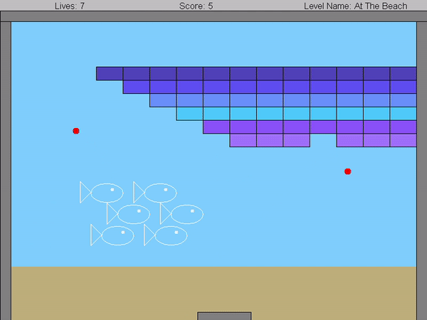

## Introduction
In this project I created the classic "Arkanoid" or "Brick Breaker" video game based on OOP concepts. 
The implementation includes various levels with increasing difficulty, usage of polymorphism, inheritance, design
patterns (decorator, observer), encapsulation, abstraction, and generic collections
data structures (linked lists, maps, etc.), all in a user-friendly GUI platform.


## Preview
<p>
  
</p>

## Installation

1. Clone the repository:
    ```
    git clone https://github.com/LiavBurger/Arkanoid.git
    ```

2. Open the project from your IDE of choice.
3. Add the biu-oop.jar file as a global library to the Arkanoid project.
4. Make sure an updated JDK is set in the configuration, and the src folder of Arkanoid is set as the source root.
5. Create a configuration with ArkanoidGame as the Main Class, run it, and enjoy!
